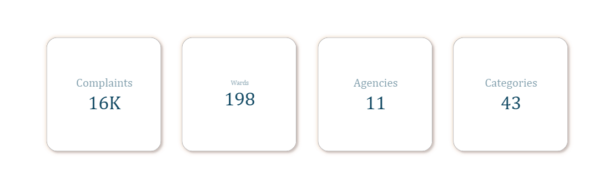
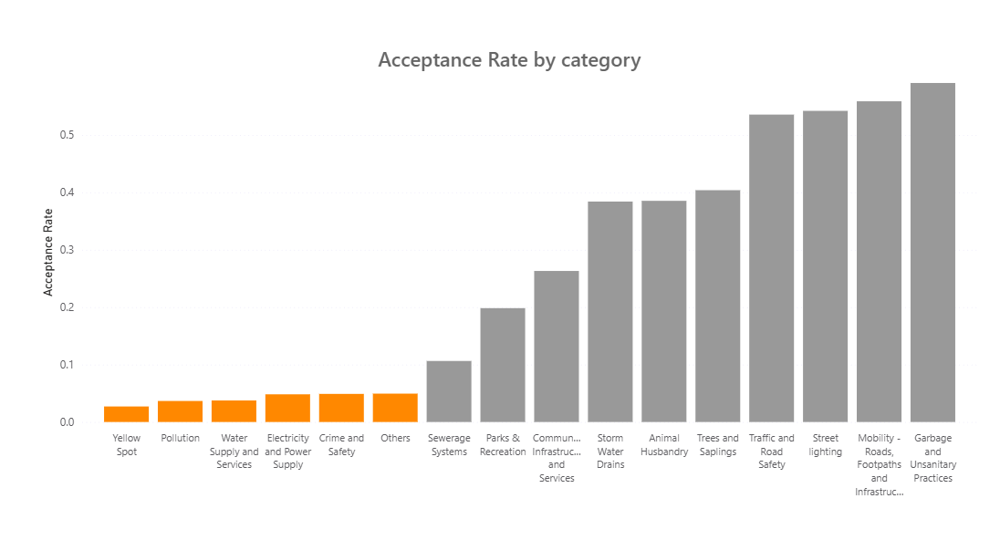

# Civic Grievance Redressal in Bangalore

A data analysis project examining complaint acceptance, resolution, and engagement patterns in Bangalore's civic grievance redressal system (BBMP), using complaint records from 2019 to 2022. The analysis covers data cleaning, dimension by dimension exploration (temporal, ward, agency, category, subcategory, and complaint tone), and the construction of a metric set that separates acceptance failures from resolution failures.

---

## Dataset

- **Source:** BBMP eMunicipal civic complaint log
- **Records:** about 16,000 complaints after cleaning
- **Coverage:** 198 wards, 11 agencies, 42 categories, January 2019 through July 2022

---

## Project Structure

```
├── Complaint_Log_Analysis_Notebook.ipynb                     # Full analysis notebook 
├── Complaint_Log_Analysis.py                        # Python script version of the notebook 
├── Complaint_Log_Analysis_Report.pdf     # Full written report with visualizations
├── Complaint_Log_Analysis_Slides.pptx    # Slide deck summary 
├── assets/                                # Chart images exported from Power BI
├── data/
│   ├── Complaint_Log_Analysis(raw).csv/        # Original unmodified dataset
│   ├── Complaint_Log_Analysis(cleaned).csv/    # Cleaned dataset
│   ├── Complaint_Log_Analysis(processed).csv/  # processed dataset
│   └── External_Data.md                       # External context sources used for temporal trend interpretation
└── README.md
```

---

## Methodology

**Data Cleaning**
Duplicate entries were dropped after being traced to a system level glitch rather than genuine repeat filings. Missing ward, category, and subcategory titles were recovered by cross filling from their corresponding numeric identifiers elsewhere in the dataset, and inconsistent agency naming was standardized to a single label per agency. A category labeled "Road and Footpaths" (113 complaints, no agency ever assigned) was identified as a duplicate of existing subcategories under Mobility, Roads, Footpaths and Infrastructure and merged into it accordingly.

External context for temporal patterns (elections, COVID 19 timeline, political transitions, civic events) is sourced and compiled in `data/External_data.md`.

**Metric Construction**
Five core metrics anchor the analysis: acceptance rate, resolution rate, effective resolution rate (Resolved divided by Total minus Open, isolating resolution success among accepted complaints from the upstream question of whether a complaint was accepted at all), ignorance rate, and re opening rate. Thresholds used to exclude low volume wards, agencies, categories, and subcategories from comparison were checked against cohort level behaviour before being applied, rather than chosen arbitrarily.

**Dimensions Analyzed**
Temporal trends, ward level performance, agency level performance, category level performance, subcategory level performance within select categories, and a keyword based complaint tone split (urgent or frustrated language).

---

## Key Findings

- Acceptance, not resolution, is the primary bottleneck for several categories. Six of sixteen compared categories accept roughly 3% to 5% of their complaints, leaving most complaints in those categories with no recorded outcome at all.
- Parks & Recreation illustrates this directly: an apparent 6.6% resolution rate corresponds to a 33% effective resolution rate once the category's near total lack of acceptance is accounted for separately.
- Performance varies within categories as much as across them. Within Mobility, acceptance rate and effective resolution rate show a moderate negative relationship across subcategories, the two highest acceptance subcategories are not the ones resolved most successfully once accepted, though the underlying cause isn't clear from the data. Within Traffic and Road Safety, helmet related complaints are resolved far more effectively than parking related complaints.
- BBMP, the dominant agency by volume, maintains a markedly higher effective resolution rate (70%) than the next most active agency, BTC (36%), despite similar acceptance rates between the two.
- Complaint volume tracks observable civic and political context, elections, COVID 19, and government transition, closely enough to suggest plausible contribution to demand, though the association is not established as causal.

<p align="center">
  <br>
  
</p>

📄 Full findings, methodology notes, and all visualizations: [Complaint_Log_Analysis_Report.pdf](Complaint_Log_Analysis_Report.pdf)

---

## How to Reproduce

```bash
pip install pandas numpy
jupyter notebook blr_analysis.ipynb
```

All charts were built separately in Power BI and exported as images into `assets/`; the notebook covers data cleaning and metric computation only.

---

## Limitations

- Why a complaint goes unacknowledged cannot be determined from the available data; low acceptance categories may reflect genuine deprioritization, processing failure, or unsolvable complaint types, and the dataset cannot distinguish between them.
- Complaint tone (urgent or frustrated) is identified through keyword matching, not a validated sentiment model, and does not capture context, sarcasm, or phrasing outside the keyword list.
- Ward level comparisons are not normalized by population or area, so resolution and acceptance rates reflect raw complaint handling, not per capita service quality.
- Associations drawn between complaint volume and external events (elections, COVID 19, government transitions) are observed coincidences, not demonstrated causes.
